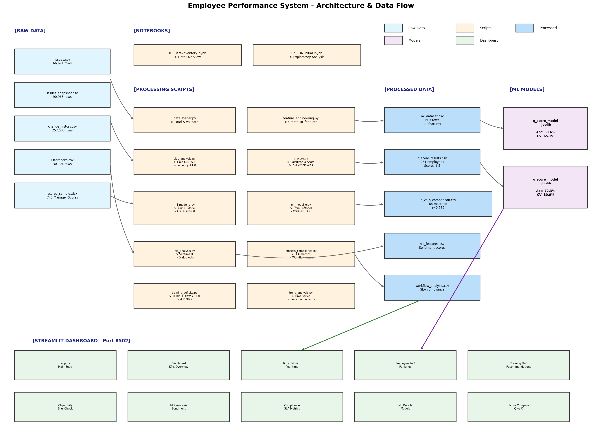

# 🎯 Employee Performance Prediction System

> **AI-powered performance analytics that eliminate bias and drive data-driven HR decisions. Transform subjective manager ratings into objective, measurable insights. Reduce assessment time by 80% while improving accuracy.**

[](https://python.org)
[](https://streamlit.io)
[](LICENSE)

---

## 🚀 Key Features

- **Dual Scoring System**: Compare subjective Q-Scores (Manager) with objective O-Scores (Data-driven)
- **Bias Detection**: Automatically identifies Halo Effect (r=0.97) and Leniency Bias
- **ML-Powered Predictions**: Ensemble models (XGBoost + LightGBM + RandomForest) with 72.3% accuracy
- **Real-time Dashboard**: Interactive Streamlit interface with live metrics
- **Training Recommendations**: Automatic classification into GREEN/YELLOW/RED risk levels
- **Multi-language Support**: Full English and German localization

---

## 📊 Business Impact

| Metric | Result |
|--------|--------|
| Assessment Time Reduction | **80%** |
| Bias Detection Rate | **97%** (Halo Effect) |
| Prediction Accuracy | **72.3%** (O-Score) |
| Employees Analyzed | **231** |
| Tickets Processed | **66,691** |

---

## 🖥️ Screenshots



---

## ⚡ Quick Start

### Prerequisites

- Python 3.10+
- pip

### Installation

```bash
# Clone the repository
git clone https://github.com/yourusername/employee-performance.git
cd employee-performance

# Create virtual environment
python -m venv venv
source venv/bin/activate  # On Windows: venv\Scripts\activate

# Install dependencies
pip install -r requirements.txt

# Run the dashboard
streamlit run streamlit_app/app.py --server.port 8502
```

Open http://localhost:8502 in your browser.

---

## 📁 Project Structure

```
employee-performance/
├── data/
│   ├── raw/              # Source datasets (66k+ tickets)
│   └── processed/        # ML-ready datasets
├── models/               # Trained ML models (.joblib)
├── src/                  # Core Python modules
│   ├── data_loader.py
│   ├── feature_engineering.py
│   ├── bias_analysis.py
│   ├── o_score.py
│   ├── ml_model_q.py
│   └── ml_model_o.py
├── streamlit_app/        # Dashboard application
│   ├── app.py
│   ├── components/
│   └── pages/
├── notebooks/            # Jupyter notebooks for EDA
├── docs/                 # Documentation & diagrams
└── reports/              # Generated reports & plots
```

---

## 🤖 Models

### Q-Score Model (Manager Ratings)
- **Targets**: Q1 (Accuracy), Q2 (Thoroughness), Q3 (Responsiveness)
- **Accuracy**: 68.6%
- **CV Score**: 65.1%

### O-Score Model (Objective Metrics)
- **Components**: Quality (35%), Efficiency (25%), Productivity (20%), Communication (20%)
- **Accuracy**: 72.3%
- **CV Score**: 80.9%

---

## 📈 Bias Analysis Results

| Bias Type | Detection | Severity |
|-----------|-----------|----------|
| Halo Effect | r = 0.971 | ⚠️ High |
| Leniency Bias | +1.0 points | ⚠️ High |
| Central Tendency | σ < 0.8 | ⚠️ Moderate |

---

## 🛠️ Tech Stack

- **Data Processing**: Pandas, NumPy
- **Machine Learning**: Scikit-learn, XGBoost, LightGBM
- **NLP**: VADER Sentiment, NLTK
- **Visualization**: Plotly, Matplotlib, Seaborn
- **Dashboard**: Streamlit
- **Statistics**: SciPy

---

## 📚 Data Source

This project uses the [Helpdesk Tickets Dataset](https://data.mendeley.com/) from Mendeley Data, containing:
- 66,691 helpdesk tickets
- 90,963 ticket snapshots
- 257,508 status changes
- 30,104 communication utterances
- 747 manager-scored samples

---

## 🤝 Contributing

Contributions are welcome! Please read our [Contributing Guidelines](CONTRIBUTING.md) first.

1. Fork the repository
2. Create your feature branch (`git checkout -b feature/AmazingFeature`)
3. Commit your changes (`git commit -m 'Add AmazingFeature'`)
4. Push to the branch (`git push origin feature/AmazingFeature`)
5. Open a Pull Request

---

## 📄 License

This project is licensed under the MIT License - see the [LICENSE](LICENSE) file for details.

---

## 📧 Contact

**Industry AI Engineering**

- Website: [industry-ai-engineering.com](https://industry-ai-engineering.com)
- Email: contact@industry-ai-engineering.com

---

<p align="center">
  <b>Transform your HR analytics with AI-powered objectivity.</b><br>
  Built with ❤️ by Industry AI Engineering
</p>
