# Project Architecture & Data Flow

## Employee Performance Prediction System

```mermaid
flowchart TB
    subgraph DATA["📁 DATA LAYER"]
        subgraph RAW["data/raw/"]
            I1[("issues.csv<br/>66,691 rows")]
            I2[("issues_snapshot.csv<br/>90,963 rows")]
            I3[("issues_change_history.csv<br/>257,508 rows")]
            I4[("sample_utterances.csv<br/>30,104 rows")]
            I5[("issues_snapshot_sample.xlsx<br/>747 scored")]
        end
    end

    subgraph NOTEBOOKS["📓 NOTEBOOKS"]
        N1["01_Data-inventory.ipynb<br/>→ Data Overview"]
        N2["02_EDA_Initial.ipynb<br/>→ Exploratory Analysis"]
    end

    subgraph SRC["⚙️ SOURCE SCRIPTS"]
        S1["data_loader.py<br/>→ Load & validate data"]
        S2["feature_engineering.py<br/>→ Create ML features"]
        S3["bias_analysis.py<br/>→ Halo/Leniency detection"]
        S4["o_score.py<br/>→ Calculate O-Score"]
        S5["ml_model_q.py<br/>→ Train Q-Score model"]
        S6["ml_model_o.py<br/>→ Train O-Score model"]
        S7["nlp_analysis.py<br/>→ Dialog Acts, Sentiment"]
        S8["process_compliance.py<br/>→ Workflow analysis"]
        S9["training_deficits.py<br/>→ Identify gaps"]
        S10["trend_analysis.py<br/>→ Time series"]
        S11["dialog_analysis.py<br/>→ Communication quality"]
        S12["generate_plots.py<br/>→ Visualization"]
    end

    subgraph PROCESSED["📊 PROCESSED DATA"]
        P1[("ml_dataset.csv<br/>603 rows")]
        P2[("o_score_results.csv<br/>231 employees")]
        P3[("q_vs_o_score_comparison.csv<br/>84 matched")]
        P4[("nlp_features.csv")]
        P5[("workflow_analysis.csv")]
        P6[("dialog_acts.csv")]
    end

    subgraph MODELS["🤖 MODELS"]
        M1[("q_score_model.joblib<br/>Acc: 68.6%<br/>CV: 65.1%")]
        M2[("o_score_model.joblib<br/>Acc: 72.3%<br/>CV: 80.9%")]
    end

    subgraph DASHBOARD["🖥️ STREAMLIT DASHBOARD"]
        D0["app.py<br/>Main Entry"]
        D1["00_Data_Inventory.py"]
        D2["01_Dashboard.py"]
        D3["02_Ticket_Monitor.py"]
        D4["03_Mitarbeiter_Performance.py"]
        D5["04_Training_Defizite.py"]
        D6["05_Objektivitaetspruefung.py"]
        D7["06_Kommunikation_NLP.py"]
        D8["07_Prozess_Compliance.py"]
        D9["08_ML_Modell_Details.py"]
        D10["10_Trend_Analyse.py"]
        D11["11_Export_Center.py"]
        D12["13_Dialog_Analyse.py"]
        D13["15_Score_Vergleich.py"]
    end

    subgraph REPORTS["📄 REPORTS"]
        R1["plots/*.png"]
        R2["Projektdokumentation_DE.pdf"]
        R3["ML_Model_Report.pdf"]
    end

    %% Data Flow
    RAW --> N1
    RAW --> N2
    RAW --> S1
    
    S1 --> S2
    S2 --> P1
    
    I2 --> S4
    S4 --> P2
    
    I5 --> S3
    S3 --> P3
    
    I4 --> S7
    S7 --> P4
    S7 --> P6
    
    I1 --> S8
    S8 --> P5
    
    P1 --> S5
    P1 --> S6
    P2 --> S6
    
    S5 --> M1
    S6 --> M2
    
    P2 --> S9
    P3 --> S9
    
    %% Dashboard connections
    RAW --> DASHBOARD
    PROCESSED --> DASHBOARD
    MODELS --> D9
    
    S12 --> R1
    
    %% Styling
    classDef dataNode fill:#e1f5fe,stroke:#01579b
    classDef scriptNode fill:#fff3e0,stroke:#e65100
    classDef modelNode fill:#f3e5f5,stroke:#7b1fa2
    classDef dashNode fill:#e8f5e9,stroke:#2e7d32
    classDef reportNode fill:#fce4ec,stroke:#c2185b
    
    class I1,I2,I3,I4,I5,P1,P2,P3,P4,P5,P6 dataNode
    class S1,S2,S3,S4,S5,S6,S7,S8,S9,S10,S11,S12,N1,N2 scriptNode
    class M1,M2 modelNode
    class D0,D1,D2,D3,D4,D5,D6,D7,D8,D9,D10,D11,D12,D13 dashNode
    class R1,R2,R3 reportNode
```

## Script Details & Outputs

### 📓 Notebooks

| Notebook | Purpose | Output |
|----------|---------|--------|
| `01_Data-inventory.ipynb` | Data exploration, schema analysis | Data overview, missing values report |
| `02_EDA_Initial.ipynb` | Initial exploratory data analysis | Distribution plots, correlations |

### ⚙️ Source Scripts

| Script | Input | Output | Key Results |
|--------|-------|--------|-------------|
| `data_loader.py` | raw/*.csv | DataFrames | 66,691 tickets loaded |
| `feature_engineering.py` | issues.csv, snapshot.csv | ml_dataset.csv | 603 samples, 20 features |
| `bias_analysis.py` | scored samples | Bias metrics | Halo: r=0.971, Leniency: +1.0 |
| `o_score.py` | issues_snapshot.csv | o_score_results.csv | 231 employees scored |
| `ml_model_q.py` | ml_dataset.csv | q_score_model.joblib | Acc: 68.6%, CV: 65.1% |
| `ml_model_o.py` | o_score_results.csv | o_score_model.joblib | Acc: 72.3%, CV: 80.9% |
| `nlp_analysis.py` | sample_utterances.csv | nlp_features.csv, dialog_acts.csv | Sentiment, Dialog Acts |
| `process_compliance.py` | issues.csv | workflow_analysis.csv | SLA compliance metrics |
| `training_deficits.py` | o_score_results.csv | Training recommendations | RED: 43, YELLOW: 89, GREEN: 99 |
| `trend_analysis.py` | issues.csv | Time series plots | Seasonal patterns |
| `dialog_analysis.py` | utterances.csv | Communication metrics | Response quality scores |
| `generate_plots.py` | All processed data | reports/plots/*.png | 20+ visualizations |

### 🤖 Models

| Model | Algorithm | Targets | Performance |
|-------|-----------|---------|-------------|
| `q_score_model.joblib` | XGBoost + LightGBM + RF Ensemble | Q1, Q2, Q3 | Acc: 68.6%, CV: 65.1% |
| `o_score_model.joblib` | XGBoost + LightGBM + RF Ensemble | O-Score (1-5) | Acc: 72.3%, CV: 80.9% |

### 🖥️ Dashboard Pages

| Page | Data Sources | Features |
|------|--------------|----------|
| Data Inventory | raw/*.csv | Schema, stats, quality |
| Dashboard | All | KPIs, overview |
| Ticket Monitor | issues.csv | Real-time tickets |
| Employee Performance | o_score_results.csv | Rankings, risk levels |
| Training Deficits | o_score_results.csv | Recommendations |
| Objectivity Check | scored samples | Bias visualization |
| Communication NLP | nlp_features.csv | Sentiment analysis |
| Process Compliance | workflow_analysis.csv | SLA metrics |
| ML Model Details | *.joblib | Feature importance, confusion matrix |
| Trend Analysis | issues.csv | Time series charts |
| Export Center | All | PDF/CSV export |
| Dialog Analysis | dialog_acts.csv | Communication patterns |
| Score Comparison | q_vs_o_score_comparison.csv | Q vs O scatter |

---

*Generated: 2026-02-17*
